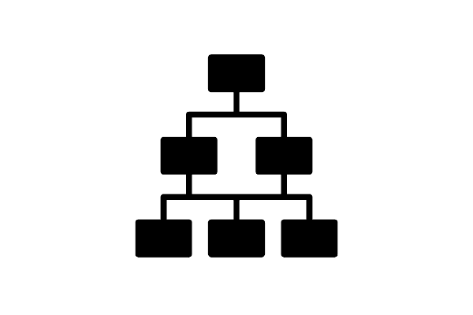

# Documento de Casos de Uso

## Lista dos Casos de Uso 2

 - [CDU 01](#CDU-01): Acessar a página de Perfil.
 - [CDU 02](#CDU-02): Fazer login.
 - [CDU 03](#CDU-03): Fazer logout.
 - [CDU 04](#CDU-04): Acessar a página de Agendamento.
 - [CDU 05](#CDU-05): Agendar no sistema.
 - [CDU 06](#CDU-06): Modificar os agendamentos.
 - [CDU 07](#CDU-07): Excluir agendamento.
 - [CDU 08](#CDU-08): Visualizar os clientes agendados.
 - [CDU 09](#CDU-09): Cadastrar funcionarios no sistema.
 - [CDU 010](#CDU-10): Cadastrar ususário.
 - [CDU 011](#CDU-10): Cadastrar ususário.
 - [CDU 012](#CDU-10): Cadastrar ususário.
 - [CDU 013](#CDU-10): Cadastrar ususário.
 - [CDU 014](#CDU-10): Cadastrar ususário.

## Lista dos Atores

 - Administrador
 - Funcionário
 - Cliente 

## Diagrama de Casos de Uso

## Descrição dos Casos de Uso

### CDU 1 - Fazer login.

#### Atores
- Administrador
- Funcionário
- Cliente 

**Fluxo Principal**

1. O sistema solicita ao usuário nome de usuário e senha de acesso.
2. O Usuário digita o nome e senha em seus respectivos espaços.
3. O usuário confirma clicando no botão "enviar".
4. O sistema verifica as informações fornecidas pelo usuário.
5. Se as informações fornecidas pelo usuário corresponderem a um login existente, o sistema permite a entrada do usuário.

**Fluxo Alternativo A**

1. O sistema solicita ao usuário nome de usuário e senha de acesso.
2. O Usuário digita nome ou senha inválidos.
3. O usuário confirma clicando no botão "enviar".
4. O sistema verifica as informações fornecidas pelo usuário.
5. O sistema apresenta a frase "login ou senha inválidos, tente novamente".

**Fluxo Alternativo B**

1. O sistema solicita ao usuário nome de identificação e senha de acesso.
2. O Usuário cancela a realização do login pressionando um botão "cancelar", exibido na tela.
3. O usuário é redirecionado para a tela de menu.

### CDU 2 - Fazer logout.

#### Atores
- Administrador
- Funcionário
- Cliente
 
**Fluxo Principal**

1. O usuário aperta o botão "logout"
2. O programa apresenta um pop UP escrito "tem certeza que deseja fazer logout?" Com duas opções "sim" e "não".
3. O usuário aperta o botão "sim".
4. O usuário é redirecionado para a página inicial.

**Fluxo Alternativo A**

1. o usuário aperta o botão  "logout".
2. O programa apresenta um pop UP escrito "tem certeza que deseja fazer logout?" Com duas opções "sim" e "não".
3. O usuário aperta o botão "não".
4. O usuário continua na página Perfil.

### CDU 3 - Agendar no sistema.

#### Atores
- Cliente
 
**Fluxo Principal**

1. O usuário seleciona a opção "Agendamento" no menu principal.
2. O usuário seleciona opção "cadastrar Agendamento". 
3. O sistema solicita os dados necessários para o agendamento do cliente.
4. O usuário fornece os dados e confirma a operação.
5. O sistema verifica se todos os dados foram fornecidos e em seguida mostra uma mensagem de confirmação.

**Fluxo Alternativo A**

1. O usuário seleciona a opção "Agendamento" no menu principal.
2. O usuário seleciona opção "cadastrar Agendamento".
3. O sistema solicita os dados necessários para o agendamento do cliente.
4. O usuário não fornece todos os dados necessários.
5. O sistema apresenta a mensagem "Favor preencher todos os dados corretamente.

### CDU 4 -  Modificar agendamentos.

#### Atores
 - Cliente

**Fluxo Principal**

1. O usuário seleciona a opção "Agendamento" no menu principal.
2. O usuário seleciona a opção editar Agendamento. 
3. Caso falte mais de 24h para o fim do agendamento, o usuário ganhara acesso para modificar seu agendamento  

**Fluxo Alternativo A**

1. O usuário seleciona a opção "Agendamento" no menu principal.
2. O usuário seleciona a opção editar Agendamento. 
3. Caso reste menos de 24h para o fim do agendamento, o sistema restringirá o acesso do usuário a edição do agendamento

### CDU 5 - Cancelar agendamento.

#### Atores
 - Administrador
 - Cliente

**Fluxo Principal**

1. O usuário seleciona a opção "Agendamento" no menu principal.
2. O usuário seleciona a opção cancelar Agendamento. 
3. O sistema solicita o código do agendamento a ser excluído.
4. O usuário fornece o código e confirma a operação.
5. O sistema verifica se o código de agendamento existe.
6. O sistema exclui o agendamento e em seguida mostra a mensagem "agendamento cancelado".

**Fluxo Alternativo A**

1. O usuário seleciona a opção "Agendamento" no menu principal.
2. O usuário seleciona a opção Excluir Agendamento. 
3. O sistema solicita o código do agendamento a ser excluído.
4. O usuário fornece um código errado e confirma a operação.
5. O sistema verifica que o código está errado. 
6. O sistema apresenta na tela a mensagem "Código de agendamento não reconhecido".
7. O sistema redireciona o usuário para o caso de uso 3 do fluxo principal.

### CDU 6 - Visualizar os clientes agendados.

#### Atores
 - Administrador
 - Funcionário

**Fluxo Principal**

1. O usuário abre a aba de agendamento. 
2. O usuário seleciona a opção visualizar agendamentos.
3. O sistema apresenta todos os horários que clientes estão agendados. 

**Fluxo Alternativo A**

1. O usuário abre a aba de agendamento. 
2. O usuário aperta a opção Cancelar.
3. O sistema redireciona o usuário para a tela de menu.

### CDU 7 - Cadastrar funcionarios no sistema.

#### Atores
 - Administrador
 
**Fluxo Principal**

1. O usuário seleciona a opção cadastrar Profissional no menu principal.
2. O sistema solicita os dados necessários para o cadastro do Profissional. 
3. O usuário fornece os dados e confirma a operação.
4. O sistema verifica se todos os dados foram fornecidos e em seguida mostra uma mensagem de confirmação.

**Fluxo Alternativo A** 

1. O usuário seleciona a opção cadastrar Profissional no menu principal.
2. O Usuário cancela a realização do cadastro pressionando um botão "cancelar", exibido na tela.
3. O usuário é redirecionado para a tela de menu.

### CDU 8 - Cadastrar usuário.

#### Atores
 - Administrador
 - Cliente

**Fluxo Principal**

1. O usuário seleciona a opção cadastrar na tela de perfil.
2. O sistema solicita os dados necessários para o cadastro. 
3. O usuário fornece os dados e confirma a operação.
4. O sistema verifica se todos foram fornecidos e em seguida mostra uma mensagem de confirmação.

**Fluxo Alternativo A** 

1. O usuário seleciona a opção cadastrar na tela de perfil.
2. O Usuário cancela a realização do cadastro pressionando um botão "cancelar", exibido na tela.
3. O usuário é redirecionado para a tela de perfil.

### CDU 9 - Cadastrar funcionarios no sistema.

#### Atores
- Administrador

**Fluxo Principal**

1. O usuário seleciona a opção cadastrar Profissional no menu principal.
2. O sistema solicita os dados necessários para o cadastro do Profissional.
3. O usuário fornece os dados e confirma a operação.
4. O sistema verifica se todos os dados foram fornecidos e em seguida mostra uma mensagem de confirmação.

**Fluxo Alternativo A**

1. O usuário seleciona a opção cadastrar Profissional no menu principal.
2. O Usuário cancela a realização do cadastro pressionando um botão "cancelar", exibido na tela.
3. O usuário é redirecionado para a tela de menu.

### CDU 10 - Cadastrar usuário.

#### Atores
- Administrador
- Cliente

**Fluxo Principal**

1. O usuário seleciona a opção cadastrar na tela de perfil.
2. O sistema solicita os dados necessários para o cadastro.
3. O usuário fornece os dados e confirma a operação.
4. O sistema verifica se todos foram fornecidos e em seguida mostra uma mensagem de confirmação.

**Fluxo Alternativo A**

1. O usuário seleciona a opção cadastrar na tela de perfil.
2. O Usuário cancela a realização do cadastro pressionando um botão "cancelar", exibido na tela.
3. O usuário é redirecionado para a tela de perfil.

### CDU 11 - Editar Cadastro de usuário.

#### Atores
- Administrador
- Cliente

**Fluxo Principal**

1. O usuário seleciona a opção cadastrar na tela de perfil.
2. O usuário seleciona a opção editar.
3. O usuário ganha acesso para modificar seu cadastro.

**Fluxo Alternativo A**

1. O usuário seleciona a opção cadastrar na tela de perfil.
2. O usuário seleciona a opção editar.
3. O usuário ganha acesso para modificar seu cadastro.
4. O usuário seleciona a opção excluir cadastro
5. O sistema retorna a mensagem "cadastro excluido" 

### CDU 12 - Listar Cadastro de usuário.

#### Atores
-Administrador

**Fluxo Principal**

1. O usuário seleciona a opção cadastrar na tela de perfil.
2. O usuário seleciona a opção listar usuarios.
3. O sistema apresenta uma lista de usuarios cadastrados.

### CDU 13 - Adicionar serviço.

#### Atores
-Administrador

**Fluxo Principal**

1. O usuário seleciona a opção serviços no menu principal.
2. O usuário seleciona a opção adicionar.
3. O sistema armazena os dados fornecidos pelo usuário
4. O sistema retorna a mensagem "serviço adicionado" 

**Fluxo Alternativo A**

1. O usuário seleciona a opção serviços no menu principal.
2. O usuário seleciona a opção adicionar.
3. O usuário seleciona a opção cancelar.
4. O usuário é redirecionado para a tela de menu.

### CDU 14 - Editar serviço.

#### Atores
-Administrador

**Fluxo Principal**

1. O usuário seleciona a opção serviços no menu principal.
2. O usuário seleciona a opção editar.
3. O usuário ganha acesso para modificar o serviço.
4. O sistema armazena os dados modificados pelo usuário
5. O sistema retorna a mensagem "serviço editado" 

**Fluxo Alternativo A**

1. O usuário seleciona a opção serviços no menu principal.
2. O usuário seleciona a opção editar.
3. O usuário ganha acesso para modificar o serviço.
4. O usuário seleciona a opção cancelar.
5. O usuário é redirecionado para a tela de menu.

**Fluxo Alternativo B**

1. O usuário seleciona a opção serviços no menu principal.
2. O usuário seleciona a opção editar.
3. O usuário ganha acesso para modificar o serviço.
4. O usuário seleciona a opção excluir.
5. O sistema retorna a mensagem "serviço excluido" 

