# Manual do Usuário

**Lista das Funcionalidades:**

 - [Fazer Login](#Fazer-Login)
 - [Fazer logout](#Fazer-logout)
 - [Fazer Cadastro](#Fazer-Cadastro)
 - [Fazer Agendamento](#Fazer-Agendamento)
 - [Abrir Perfil](#Abrir-Perfil)
 - [Editar dados](#Editar-dados)
 - [Excluir conta](#Excluir-conta)
 - [Recuperação de senha](#Recuperação-de-senha)

## Fazer login

Para o usuário fazer login no site, o usuário deve clicar no botão (destacado acima). 

Apos isso o usuário deve clicar na mensagem “Entrar”(destacado acima).

Apos isso usuário deve preencher as caixas de texto (destacadas acima) com e-mail e senha respectivamente e apertar o botão entrar 
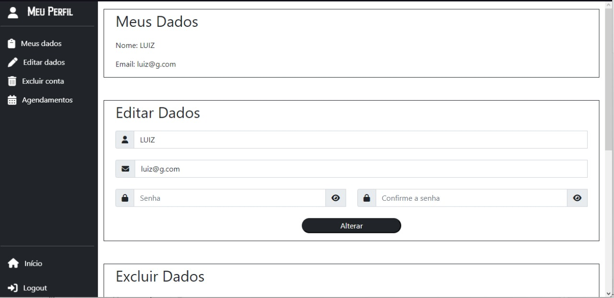
Se os dados forem corretos, o usuário dever ser redirecionado para a página de perfil 

## Fazer logout

Para o usuário efetuar o logout, ele deve clicar no botão de perfil (destacado acima).

Apos isso o usuário deve clicar na mensagem “Sair”(destacado acima).

## Fazer Cadastro

Para o usuário realizar o cadastro ele deve clicar no botão de perfil (destacado acima). 

Após a abertura do pop-up, o usuário deve clicar em “Cliente novo? Cadastre-se” (destacado acima). 

Após isso, o usuário deverá fornecer as informações necessárias(Nome, e-mail, senha e confirmação de senha) para o cadastro e confirmá-las, clicando no botão “Cadastrar”.

Se os dados preenchidos forem corretos, o usuário será redirecionado para página de perfil.

## Fazer Agendamento

Para realizar o agendamento, o usuário deverá clicar no botão “Agendamento” (destacado acima).
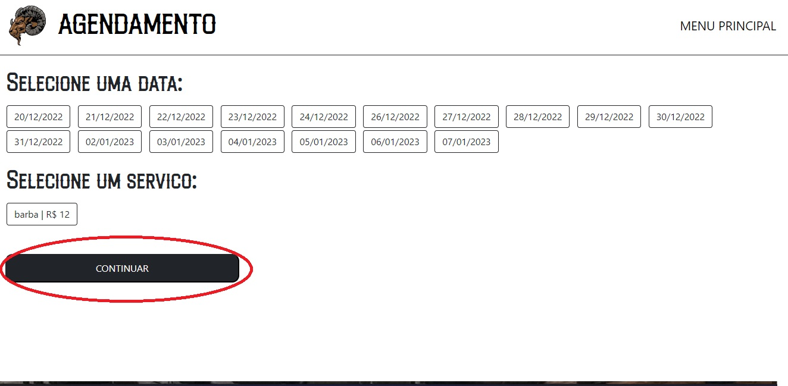
 Após isso, o usuário será redirecionado para uma página exigindo que o usuário seleciona uma data e um serviço e aperte o botão “continuar” (destacado acima). 
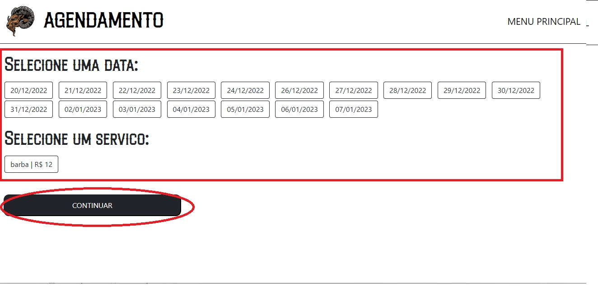
Após selecionar data e serviço, o sistema redireciona o usuário a uma página exibindo horários disponíveis para a data selecionada, o usuário deverá selecionar um desses horários e apertar o botão “continuar” (destacado acima).
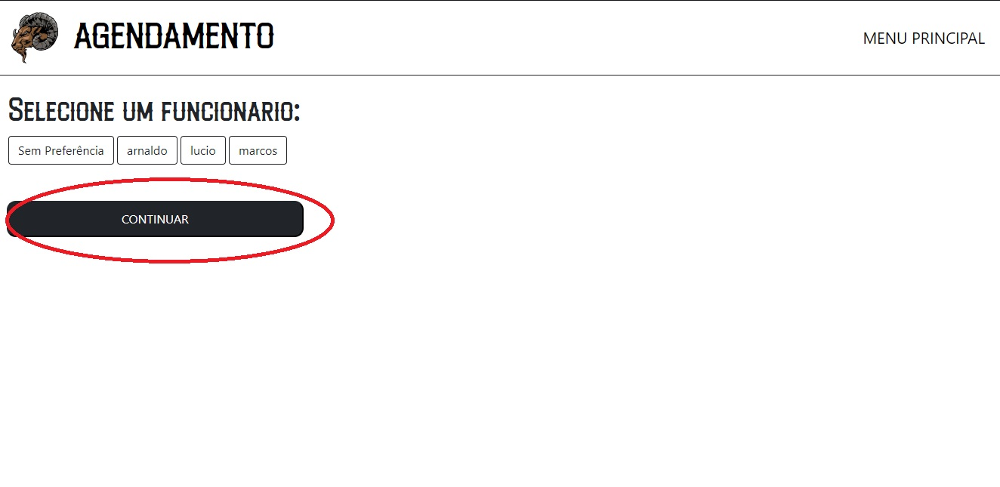
Assim que o usuário selecionar o horário desejado, ele deve selecionar o funcionário de sua preferência ou não, e apartar o botão “continuar”(destacado acima). 
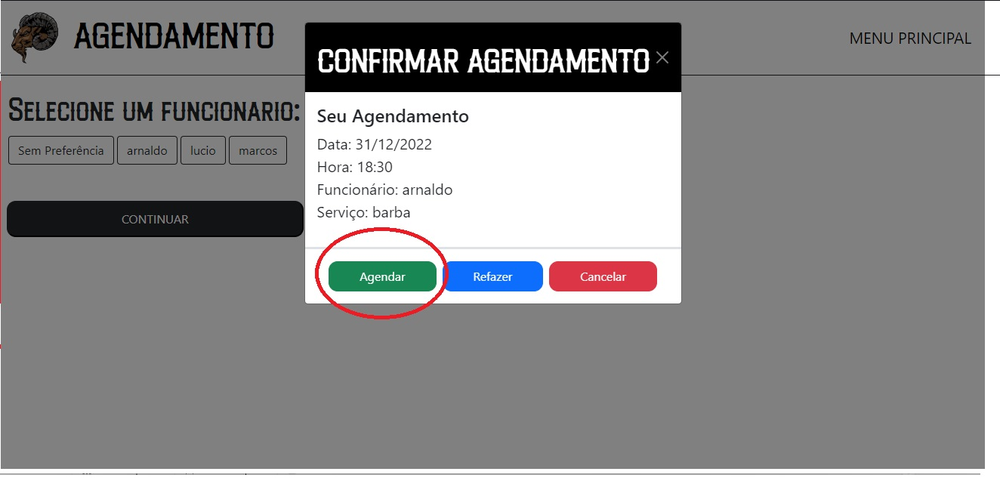
Após selecionar o funcionário, o sistema exibirá um pop-up exibindo os dados do seu agendamento e exigindo uma confirmação ou um cancelamento do mesmo(destacado acima).

Após confirmar seu agendamento, o usuário será redirecionado para sua tela de perfil, que exibirá todos os agendamentos realizados pelo usuário.

## Abrir Perfil

Para o usuário abrir o seu perfil, primeiro ele deve se certificar de estar logado, assim que efetuar o login (ensinado no tópico 1) 
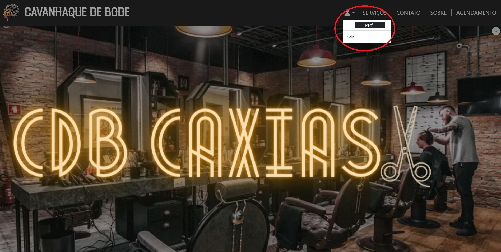
O usuário deverá clicar no botão perfil(destacado acima).

Após clicar, o usuário será redirecionado para uma página que exibirá todos os dados armazenados em seu perfil, como seus agendamentos, seus dados de usuário e as opções de editar dados e excluir conta.

## Editar dados 

Para o usuário editar os seus dados de perfil, ele deve se certificar de estar logado e clicar no Botão de perfil(destacado acima). 

Após clicar, o usuário será redirecionado para página de perfil.

Nessa página, o usuário deve clicar em editar dados(destacado acima)

Após clicar em alterar dados, o usuário deve preencher os campos com os dados que deseja alterar. 

Após preencher os campos, o usuário deve confirmar a alteração clicando no botão alterar.

## Excluir conta

Para o usuário excluir sua conta, ele deve se certificar de estar logado e clicar no Botão de perfil(destacado acima).
 
Após clicar, o usuário será redirecionado para página de perfil. 

Nessa página, o usuário deve clicar em excluir conta(destacado acima).

O usuário deve preencher os campos (destacados acima) com sua senha e confirmação de senha. 

Após preencher os campos, o usuário deve confirmar a exclusão clicando no botão excluir (destacado acima).

## Recuperação de senha

Para realizar a recuperação de senha o usuário deve clicar no botão de perfil (destacado acima). 
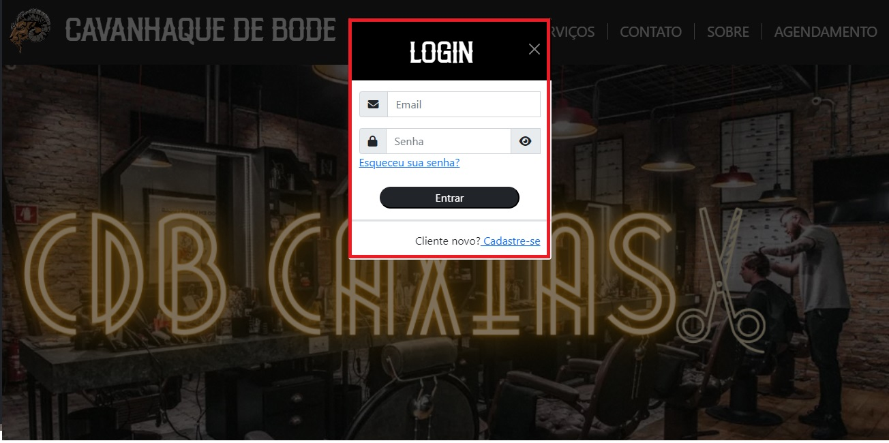
Após clicar no botão de perfil, o sistema exibirá um pop-up de login(destacado acima). 
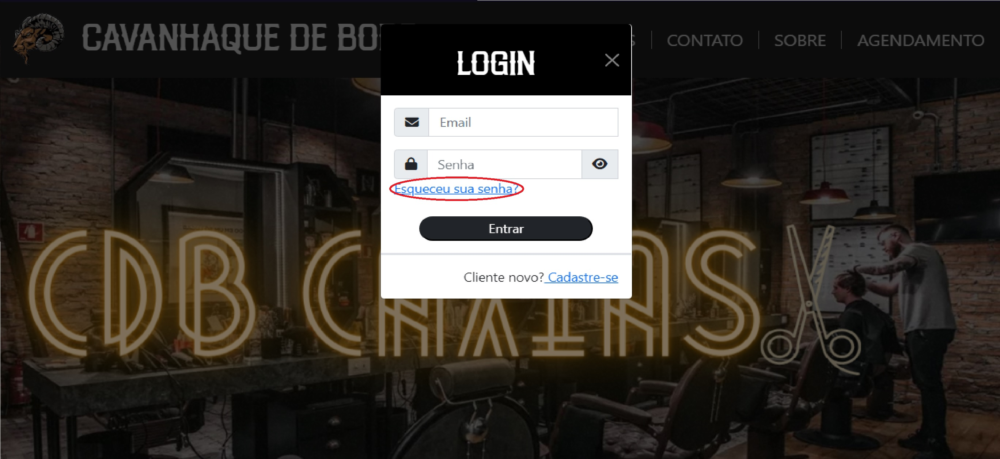
Para o usuário recuperar sua senha ele deve clicar em esqueceu sua senha?(destacado acima). 
Após clicar em esqueceu sua senha, o sistema irá redirecionar o usuário para uma página que exigirá o e-mail da conta que o usuário esqueceu a senha e irá enviar um código de recuperação para o mesmo. 
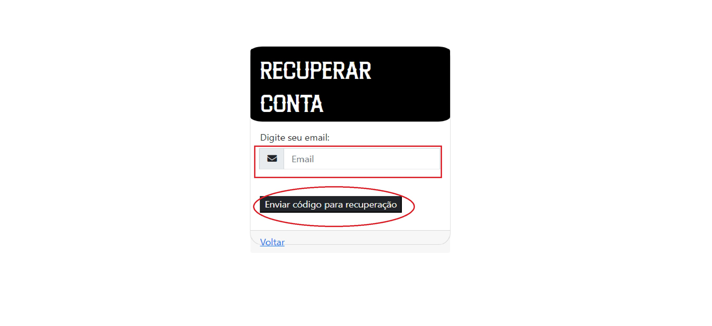
O usuário deverá checar a sua caixa de e-mail e digitar o código enviado pelo sistema no site.
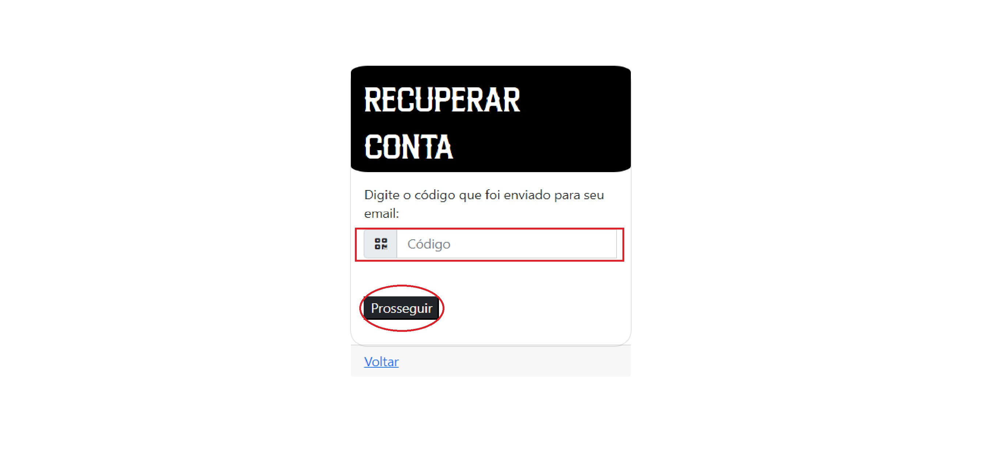
Assim que o usuário preencher com o código correto, ele deverá clicar no botão prosseguir (destacado acima). 
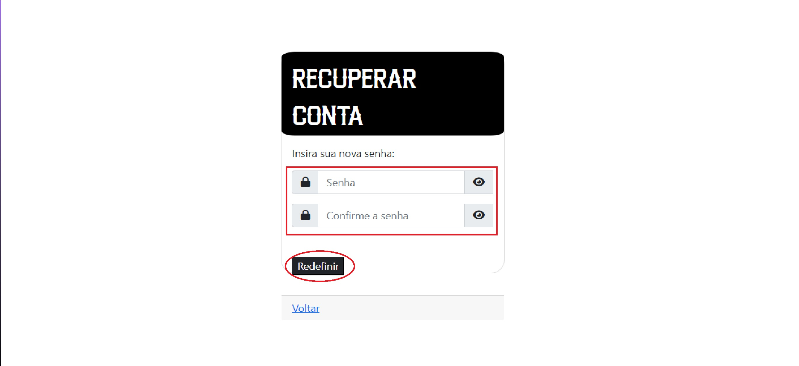
Após isso o sistema irá redirecionar o usuário para uma nova página requisitando uma nova senha e a confirmação da mesma (destacado acima).

Após a confirmação da senha, o usuário será redirecionado para tela principal.
